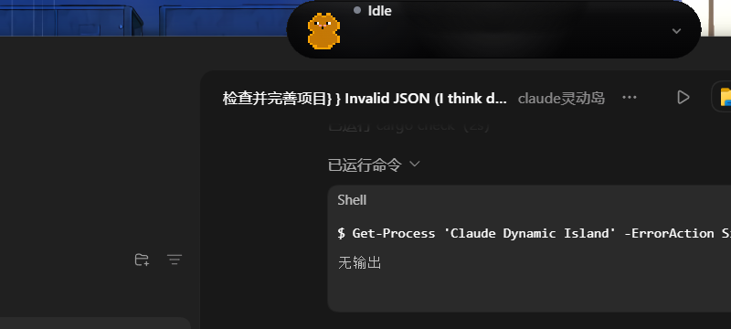
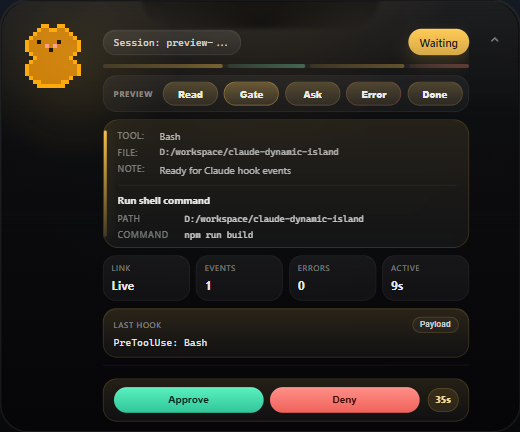
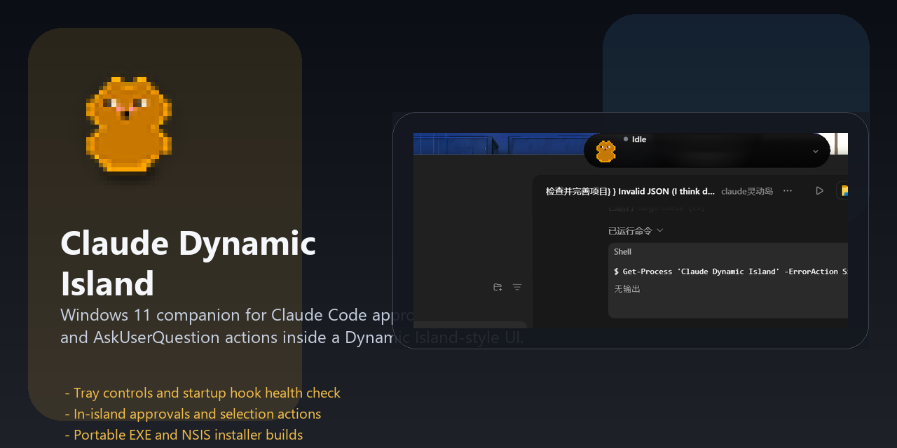

# Claude Dynamic Island

A Windows 11 dynamic island companion for Claude Code, built with Tauri v2, Rust, and TypeScript.

Claude Dynamic Island brings Claude Code hook events into a compact top-docked island UI. It can show tool activity, notifications, approvals, and `AskUserQuestion` choices without forcing you to switch back to the terminal.



## Why This Project Exists

Claude Code is powerful, but its hook events usually live in the terminal. This project turns those events into a persistent Windows 11 style companion:

- top-docked dynamic island window
- pixel mascot with state-driven animation
- in-island approvals and selections
- browser preview controls for local UI smoke tests and screenshots
- activity timeline with tool type, elapsed time, and approval state
- tray controls with show and exit actions
- startup hook self-check
- portable EXE and NSIS installer builds

## Screenshots

### Desktop Integration


### Island Close-Up



### Social Preview Asset



## Current Feature Set

- Real Claude Code HTTP hooks for `PreToolUse`, `PostToolUse`, `Notification`, and `Stop`
- Top-docked island with collapse and expand behavior
- Auto-approve support for safe tools such as `Read`, `Grep`, and `Glob`
- In-island approval actions for gated tools
- In-island `AskUserQuestion` choices
- Browser preview controls for Read, approval, question, error, and completion states
- Compact activity history with tool-aware badges and elapsed session timing
- Tray menu with `Show` and `Exit`
- Startup hook diagnostics so the app can surface configuration issues early
- Portable release folder with `_up_` resources
- NSIS installer output for Windows distribution

## Tech Stack

- Tauri v2
- Rust
- TypeScript
- Vite
- Windows 11

## Quick Start

### Requirements

- Node.js 18+
- Rust stable
- Windows 11

### Development

```bash
npm install
npm run tauri dev
```

### Production Build

```bash
npm run tauri build
```

### Portable Release Folder

```bash
npm run build:release
```

This creates a ready-to-run folder in:

```text
release/
```

Key files:

- `Claude Dynamic Island.exe`
- `Launch Claude Dynamic Island.bat`
- `_up_/`

### NSIS Installer

```bash
npm run tauri build -- --bundles nsis
```

Installer output:

```text
src-tauri/target/release/bundle/nsis/
```

## How Claude Hooks Are Wired

On startup, the app installs or updates HTTP hooks for Claude Code:

- user scope: `~/.claude/settings.json`
- workspace scope: `.claude/settings.local.json` when the current directory is a real project workspace

The project uses HTTP hooks, not the old PowerShell `command` hooks.

## Repository Layout

```text
src/                    frontend UI, event bus, island behavior
src-tauri/src/          Rust backend, hook server, window control
characters/             mascot assets
docs/images/            GitHub screenshots and preview assets
scripts/                build, icon, and release helper scripts
```

## Verification

Core verification commands:

```bash
npm test
npx tsc --noEmit
cd src-tauri && cargo check && cargo test
```

GitHub CI also runs the Windows verification path on every push and pull request.

## Release Notes

Release preparation and smoke checks are documented in [docs/release-checklist.md](docs/release-checklist.md).

## Contributing

Contribution and local workflow notes are in [CONTRIBUTING.md](CONTRIBUTING.md).
